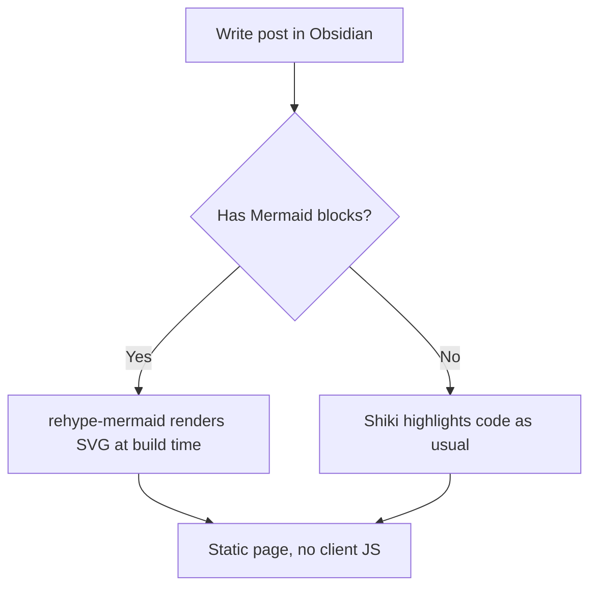
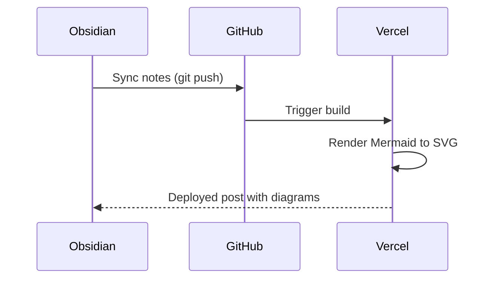

A flowchart:



A sequence diagram:



A normal code block, to confirm Shiki still highlights everything else:

```ts
export function greet(name: string): string {
  return `Hello, ${name}!`;
}
```
